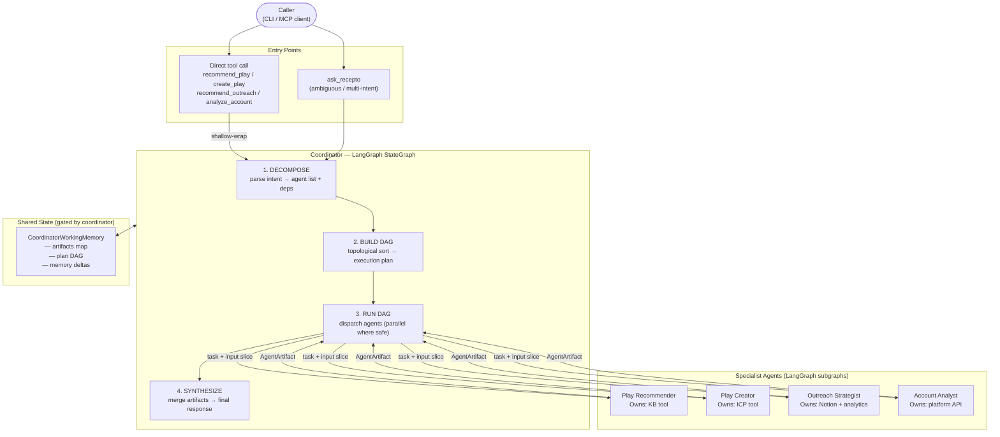

# Recepto MCP — Prototype Implementation Plan

**Status:** Prototype implemented under `prototype/` (LangGraph coordinator, four agents, offline mocks). Keep this doc as the design reference; adjust schemas as you align with product.
**Audience:** You (to study) + Dhruv (to discuss)
**Scope:** Prototype only — LangGraph StateGraph, mocked APIs, fully runnable

---

## Table of Contents

1. [Why this prototype exists](#1-why-this-prototype-exists)
2. [High-Level Design (HLD)](#2-high-level-design-hld)
3. [Problem decomposition — how the orchestrator thinks](#3-problem-decomposition--how-the-orchestrator-thinks)
4. [Routing decision — direct tool vs coordinator](#4-routing-decision--direct-tool-vs-coordinator)
5. [DAG construction — parallel vs sequential](#5-dag-construction--parallel-vs-sequential)
6. [Low-Level Design (LLD)](#6-low-level-design-lld)
7. [Agent internals and tool ownership](#7-agent-internals-and-tool-ownership)
8. [Memory and state flow](#8-memory-and-state-flow)
9. [Failure handling](#9-failure-handling)
10. [Mock data and what is faked](#10-mock-data-and-what-is-faked)
11. [Demo scenarios (3 runnable queries)](#11-demo-scenarios-3-runnable-queries)
12. [File structure](#12-file-structure)
13. [Out of scope for prototype](#13-out-of-scope-for-prototype)
14. [Open questions for Dhruv](#14-open-questions-for-dhruv)

---

## 1. Why this prototype exists

The original Recepto system used **fixed pipelines** — one script per GTM use case, steps hardcoded in order, integrations wired directly into the pipeline body.

Three problems hit hard during migration to agents:

| Problem | Pain |
|---------|------|
| **B — Shared state** | All agents reading/writing a global dict → untraceable bugs, stale data |
| **C — Tool bleed** | Any agent calling any integration → hidden coupling, impossible to isolate |
| **D — Parallel vs sequential** | No principled way to decide what runs in parallel vs waits → either slow or broken |

This prototype **demonstrates the solution to each problem** in runnable code using LangGraph, so the patterns can be validated before building production.

---

## 2. High-Level Design (HLD)

### System overview



### Key architectural rules

1. **Coordinator is the only node that writes to shared state.** Agents propose; coordinator commits.
2. **Agents never call each other.** Agent B gets Agent A's output only if the coordinator passes it as an input artifact.
3. **Each agent owns its tools exclusively.** No shared tool registry.
4. **DAG is built per request**, not hardcoded per use case.

---

## 3. Problem decomposition — how the orchestrator thinks

This is the most important section. It answers: *given a user query, how does the coordinator decide what to do?*

### Step 1 — Intent extraction

The coordinator's first node (`decompose`) runs an LLM call (or simple classifier for the prototype) on the raw query and extracts:

```python
@dataclass
class DecomposedIntent:
    intents: list[IntentKind]          # e.g. [RECOMMEND_PLAY, CREATE_PLAY]
    entities: dict[str, str]           # e.g. {"industry": "fintech", "account": "Stripe"}
    ambiguous: bool                    # true if intent is unclear
    requires_clarification: bool       # true if entities are missing
```

`IntentKind` is an enum:
```python
class IntentKind(str, Enum):
    RECOMMEND_PLAY    = "recommend_play"
    CREATE_PLAY       = "create_play"
    RECOMMEND_OUTREACH = "recommend_outreach"
    ANALYZE_ACCOUNT   = "analyze_account"
```

### Step 2 — Agent selection

Each `IntentKind` maps to exactly one agent:

| IntentKind | Agent |
|------------|-------|
| `RECOMMEND_PLAY` | Play Recommender |
| `CREATE_PLAY` | Play Creator |
| `RECOMMEND_OUTREACH` | Outreach Strategist |
| `ANALYZE_ACCOUNT` | Account Analyst |

If `decomposed.intents` has one item → single agent run.
If multiple items → build a DAG (see Section 5).

### Step 3 — Dependency resolution

Not all multi-intent queries are independent. The coordinator checks a **dependency table**:

| If intent A is present... | ...and intent B is present | then |
|---------------------------|---------------------------|------|
| `RECOMMEND_PLAY` | `CREATE_PLAY` | A must finish before B (Creator needs recommendation artifact) |
| `ANALYZE_ACCOUNT` | `RECOMMEND_OUTREACH` | Can run in parallel (neither needs the other's output) |
| `ANALYZE_ACCOUNT` | `CREATE_PLAY` | A should run first (Creator can use AccountBrief as optional input) |

This table is **explicit and inspectable** — not inferred by the LLM at runtime.

---

## 4. Routing decision — direct tool vs coordinator

Two entry paths exist. Here is exactly how the decision works:

```
Caller invokes tool
        │
        ├── Direct tool (recommend_play, create_play, etc.)
        │       │
        │       └── Shallow-wrap: build RequestContext with intent already known
        │           Skip decompose step → jump straight to BUILD DAG
        │           (DAG has exactly one node for direct calls)
        │
        └── ask_recepto
                │
                └── Full decompose step → may produce 1–4 intents → build full DAG
```

**Why shallow-wrap instead of bypassing coordinator entirely?**
Direct tools still go through the coordinator so that:
- Every request gets a `trace_id`
- `CoordinatorWorkingMemory` is always populated (consistent observability)
- Follow-up calls in a session can access artifacts from prior direct calls

**When does a query go to `ask_recepto` vs a direct tool?**
- Caller knows the intent → direct tool (IDE plugin, structured UI)
- Natural language query, ambiguous, or multi-intent → `ask_recepto`

---

## 5. DAG construction — parallel vs sequential

### How the DAG is built

After decomposition the coordinator runs `build_dag(intents, dependency_table)`:

```python
def build_dag(intents: list[IntentKind]) -> list[DAGNode]:
    nodes = [DAGNode(intent=i) for i in intents]
    for node in nodes:
        node.depends_on = [
            other for other in nodes
            if DEPENDENCY_TABLE.get((other.intent, node.intent)) == "sequential"
        ]
    return topological_sort(nodes)
```

Result is a list of **execution waves** — agents within the same wave run in parallel; waves run sequentially.

### Example: "recommend a play and analyze Stripe"

```
Intents: [RECOMMEND_PLAY, ANALYZE_ACCOUNT]
Dependencies: none between them
DAG:
  Wave 1 (parallel): [Play Recommender, Account Analyst]
  Wave 2: [synthesize]
```

### Example: "recommend a play then create it"

```
Intents: [RECOMMEND_PLAY, CREATE_PLAY]
Dependencies: RECOMMEND_PLAY → CREATE_PLAY
DAG:
  Wave 1: [Play Recommender]
  Wave 2: [Play Creator]  ← receives PlayRecommendationCandidates artifact
  Wave 3: [synthesize]
```

### Example: single intent

```
Intents: [RECOMMEND_PLAY]
DAG:
  Wave 1: [Play Recommender]
  Wave 2: [synthesize]
```

### Why not just use a graph with cycles + a max-iteration cap?

A valid question. You could allow cycles and break them with a counter:

```
[Recommender] → [Creator] → [Recommender] → [Creator] → STOP (max=3)
```

But this has real problems:

| Problem | Why it matters |
|---------|----------------|
| **Non-deterministic output** | Which iteration is the "right" answer — pass 1, 2, or 3? |
| **No convergence guarantee** | The loop may hit max without producing useful work |
| **Hard to trace** | Which pass of Recommender are you debugging? |
| **Wasted compute** | The right answer may have come at pass 1, but you ran 3 |

Cycles **can** work — LangGraph's ReAct agents use them — but only when there is a **meaningful exit condition**, not just a hard cap:

```
think → act → observe → (task done? → exit) or (not done? → think again)
```

For GTM orchestration there is no natural "keep refining until converged" loop. Each agent does its job once and hands off a typed artifact. A DAG is the cleaner and safer fit.

---

## 6. Low-Level Design (LLD)

### State schema

```python
# state.py

@dataclass(frozen=True)
class RequestContext:
    trace_id: str
    user_query: str
    tool_name: str        # "ask_recepto" or direct tool name
    tenant_id: str = "demo"

@dataclass
class AgentArtifact:
    agent_kind: str       # "recommender" | "creator" | "outreach" | "analyst"
    step_id: str          # trace_id + agent_kind
    payload: dict         # typed per agent (see Section 7)
    status: str           # "ok" | "failed" | "skipped"
    error: str | None = None

@dataclass
class MemoryDelta:
    tier: str             # "M1" | "M2"
    key: str
    value: str
    reason: str           # why the agent is proposing this

class CoordinatorState(TypedDict):
    request: RequestContext
    plan_dag: list[dict]                    # serialized DAG nodes
    artifacts: dict[str, AgentArtifact]    # keyed by agent_kind
    pending_memory_deltas: list[MemoryDelta]
    final_response: str | None
```

### LangGraph coordinator graph

```python
# coordinator.py

coordinator_graph = StateGraph(CoordinatorState)

coordinator_graph.add_node("decompose", decompose_node)
coordinator_graph.add_node("build_dag", build_dag_node)
coordinator_graph.add_node("run_wave", run_wave_node)   # loops per wave
coordinator_graph.add_node("synthesize", synthesize_node)

coordinator_graph.add_edge(START, "decompose")
coordinator_graph.add_edge("decompose", "build_dag")
coordinator_graph.add_edge("build_dag", "run_wave")
coordinator_graph.add_conditional_edges(
    "run_wave",
    more_waves,             # returns True if waves remain
    {True: "run_wave", False: "synthesize"}
)
coordinator_graph.add_edge("synthesize", END)
```

### Agent subgraph shape (same pattern for all 4)

```python
# agents/recommender.py (example)

agent_graph = StateGraph(AgentLocalState)

agent_graph.add_node("parse_input", parse_input_node)
agent_graph.add_node("call_tool", call_kb_tool)        # KB tool — owned here only
agent_graph.add_node("rank_results", rank_results_node)
agent_graph.add_node("package_artifact", package_artifact_node)

# returns AgentArtifact with payload:
# { candidates: [...], rationale_short: str, citations: [...] }
```

---

## 7. Agent internals and tool ownership

### The rule

Each agent imports and calls **only its own tools**. There is no shared tool registry. This is enforced by module boundaries — tools live inside the agent's file or a private submodule.

| Agent | Owned tools | Output artifact payload |
|-------|-------------|------------------------|
| Play Recommender | `kb_search(query)` → reads `mocks/plays.json` | `{candidates[], rationale_short, citations[]}` |
| Play Creator | `icp_builder(goal)`, `intent_mapper(goal)` → mock | `{play_id, play_object, validation_warnings[]}` |
| Outreach Strategist | `analytics_fetch(play_ref)`, `notion_lookup(playbook)` → mock | `{strategies[], rationale, risks[]}` |
| Account Analyst | `platform_api(account_id)` → reads `mocks/accounts.json` | `{snapshot, signals[], suggested_next_question}` |

### How an agent receives input

The coordinator passes a **slice** of `CoordinatorState` to the agent — never the full state:

```python
agent_input = AgentInput(
    request=state["request"],
    relevant_artifacts={
        k: v for k, v in state["artifacts"].items()
        if k in AGENT_DEPS[agent_kind]   # only what this agent declared it needs
    }
)
```

Agent B never sees Agent A's raw internal scratch — only the structured artifact the coordinator extracted.

---

## 8. Memory and state flow

### Three tiers (prototype uses M0 and M1 only)

| Tier | Scope | Mechanism in prototype |
|------|-------|------------------------|
| M0 — Ephemeral | Single request | LangGraph `CoordinatorState` (in-memory, gone after run) |
| M1 — Session | Same process run | Simple Python dict keyed by `session_id`, capped at 5 entries |
| M2 — Durable | Across runs | **Out of scope for prototype** |

### Memory write flow (Problem B solution)

```
Agent proposes MemoryDelta
        │
        ▼
Coordinator synthesize node reviews delta
        │
        ├── PII check (simple keyword block list for prototype)
        ├── TTL / relevance check
        └── Commits to M1 store (or discards)

Agents NEVER write directly to M1.
```

This makes every memory write observable and attributable.

---

## 9. Failure handling

Even in the prototype, partial failures should be explicit:

| Scenario | Behaviour |
|----------|-----------|
| Agent returns an error | Artifact marked `status: "failed"`, downstream agents that depend on it are marked `status: "skipped"` |
| Parallel branch fails | Other parallel branches still complete; synthesizer notes which branch failed |
| Decompose fails | Return error immediately, no DAG built |

No silent failures. Every artifact has a `status` field the synthesizer reads.

---

## 10. Mock data and what is faked

| Component | Mock mechanism | File |
|-----------|---------------|------|
| Recepto KB | Static JSON, `kb_search` does keyword match | `mocks/plays.json` |
| Account data | Static JSON, lookup by account name | `mocks/accounts.json` |
| ICP builder | Returns hardcoded ICP object based on goal keywords | inline in `agents/creator.py` |
| Notion playbooks | Returns static list of strategies | inline in `agents/outreach.py` |
| Analytics | Returns random performance numbers | inline in `agents/outreach.py` |
| LLM calls (decompose, synthesize) | Replaced with rule-based classifier + template strings | `coordinator.py` |

**Nothing calls an external API.** The prototype runs fully offline.

---

## 11. Demo scenarios (3 runnable queries)

`main.py` runs all three in sequence and prints a trace for each.

### Scenario 1 — Single agent (direct tool path)

```
Query: "recommend a play for a fintech company with high intent signals"
Entry: recommend_play (direct tool)
DAG:   [Play Recommender]
Shows: Problem C — Recommender uses only its KB tool, no bleed
```

### Scenario 2 — Sequential agents

```
Query: "recommend a play for a SaaS company and then create it"
Entry: ask_recepto
DAG:   [Play Recommender] → [Play Creator]
Shows: Problem B — Creator receives only the recommendation artifact slice,
       not the full coordinator state
```

### Scenario 3 — Parallel agents

```
Query: "analyze Stripe's account and recommend an outreach strategy"
Entry: ask_recepto
DAG:   [Account Analyst] ∥ [Outreach Strategist] → [synthesize]
Shows: Problem D — Both agents run in the same wave; synthesizer merges artifacts
```

Expected terminal output per scenario:
```
[trace_id=abc123] decompose → intents: [RECOMMEND_PLAY]
[trace_id=abc123] build_dag → waves: [[recommender]]
[trace_id=abc123] run_wave 1 → recommender: ok
[trace_id=abc123] synthesize → "Top play: Champion Activation..."
```

---

## 12. File structure

```
prototype/
├── main.py                  # runs 3 demo scenarios
├── state.py                 # all TypedDicts and dataclasses
├── coordinator.py           # LangGraph StateGraph + decompose/build_dag/synthesize nodes
├── agents/
│   ├── recommender.py       # Play Recommender subgraph + kb_search tool
│   ├── creator.py           # Play Creator subgraph + icp_builder tool
│   ├── outreach.py          # Outreach Strategist subgraph + notion/analytics tools
│   └── analyst.py           # Account Analyst subgraph + platform_api tool
├── mocks/
│   ├── plays.json           # 4 sample plays with tags and signals
│   └── accounts.json        # 3 sample accounts (Stripe, Notion, Linear)
├── memory.py                # M0/M1 in-memory store + MemoryDelta commit logic
└── requirements.txt         # langgraph, langchain-core only
```

---

## 13. Out of scope for prototype

- Real LLM calls (decompose and synthesize use rules/templates)
- Real Recepto APIs
- M2 durable memory
- MCP server wrapper (prototype runs as a plain Python script)
- Authentication / multi-tenancy
- Guardrails / output validation
- LangSmith tracing integration

---

## 14. Open questions for Dhruv

These are things to align on before or during the review:

1. **Decompose logic** — For the real system, should decomposition be LLM-based, a rule classifier, or hybrid? The prototype uses rules; production may need the LLM for fuzzy queries.

2. **`ask_recepto` boundary** — Should direct tool calls ever skip the coordinator entirely (for speed), or always shallow-wrap (for tracing)? Prototype shallow-wraps always.

3. **Dependency table ownership** — The table mapping `(IntentA, IntentB) → sequential/parallel` is currently hardcoded. Should this be configurable (e.g. per tenant), or is it stable enough to stay in code?

4. **M1 session scope** — In the prototype, M1 is per-process. In production, what defines a "session"? A Slack thread? A Cursor tab? An explicit session ID from the caller?

5. **Artifact schema stability** — The 4 artifact payload shapes are defined here. Are these the right fields, or does Dhruv have existing data contracts from the current Recepto system that should be matched?

6. **Parallel execution model** — Prototype uses `asyncio.gather` for parallel waves. Is that acceptable for the real system, or does Dhruv expect LangGraph's native parallel branching (`Send` API)?

---

## Approval checklist

Before implementation starts, confirm:

- [ ] File structure looks right
- [ ] State schema fields are sufficient
- [ ] 3 demo scenarios cover what needs to be shown
- [ ] Dependency table logic is correct
- [ ] Mock data scope is agreed (what goes in `plays.json` / `accounts.json`)
- [ ] Open questions resolved or deferred

---

*Once approved, implementation follows phases: state.py → coordinator.py → one agent → wire all agents → main.py demos.*
