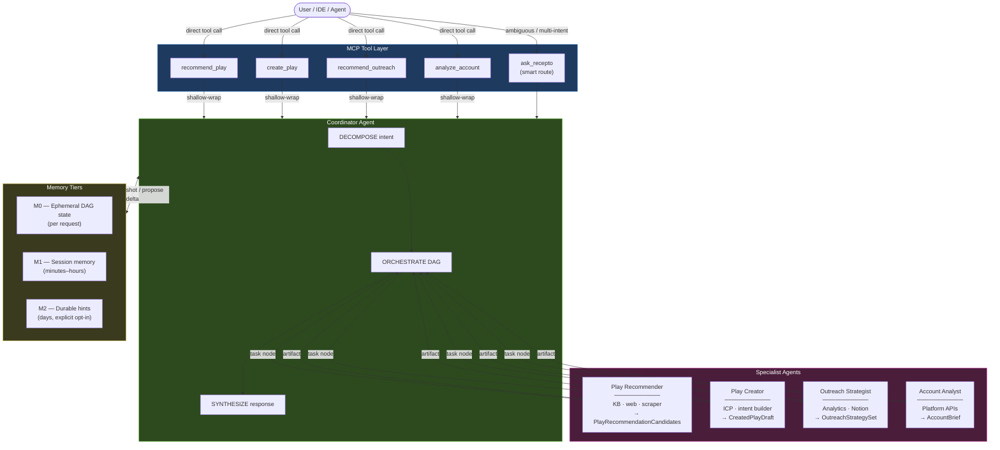

#  MCP — Pipeline → Agents Migration

**What this document is:** a **pipeline → agents conversion guide**—how today’s fixed GTM flows become a **coordinator + four specialist agents + MCP**, including memory/context and how work is handed off **without** turning everything into one brittle script.

---

## One-line pitch

Replace **fixed, scripted pipelines** for GTM workflows with **a small MCP server** that routes work through a **coordinator + specialist agents**—so intent is decomposed dynamically instead of coded as one-off chains.

---

## How to convert a pipeline to agents (conceptual recipe)

Treat each **existing pipeline** as *trigger → ordered steps → integrations → output*. Conversion reassigns roles like this:

| Today (pipeline) | After conversion (agents) |
|------------------|---------------------------|
| Runner that always executes the same sequence | **Coordinator** that builds a **DAG** per request (which agents run, in what order, what is parallel) |
| A step = a fixed function in the script | **Task node** on one **specialist agent**; that agent’s finer steps stay inside its own subgraph |
| Branching via `if/else` in code | **Decomposition + routing** (direct MCP tool vs `ask_recepto`); follow-ups go through the coordinator |
| Integrations wired into the pipeline body | **Tools** attached only to the agent that owns that domain |
| Ad-hoc shared context between steps | **`CoordinatorWorkingMemory` + typed artifacts** (see implementation plan below) |
| A new use case = copy-paste a new pipeline | Reuse the same four agents; add **plan templates** / routing rules |

**What you do in practice:**

1. **Inventory** each pipeline: triggers, steps, external systems, outputs.  
2. **Map steps → one specialist** per domain; put cross-cutting merge/routing in the **coordinator**.  
3. **Wrap each integration** as a tool on the right agent (keep existing clients where you can; mock what you don’t have keys for).  
4. **Replace linear control** with a **DAG** of agent tasks (e.g. recommend → create; parallel account + outreach when independent).  
5. **Expose MCP** (per-use-case tools + `ask_recepto` for fuzzy or multi-intent input).  
6. **Add memory** (session + optional durable hints) as **explicit coordinator-gated updates**, not hidden side effects.

The **Prototype brainstorm** proves **4–5** fast. The **Full four-agent implementation plan** carries **2–6** through all four agents with memory and handoffs.

---

## Migration problems & solutions (prototype learnings)

The three hardest problems hit during migration from fixed pipelines to agentic orchestration — and what was done about each.

---

### Problem B — Shared state turned into a hidden mess

**What the problem was:**
Pipelines pass context implicitly between steps — shared variables, dicts passed along a chain. When splitting these into agents, the first instinct was to give all agents access to one shared memory object. Any agent could read or write anything. That made debugging nearly impossible: you couldn't tell which agent wrote what, or why an agent had stale or unexpected data.

**What I tried:**
A global shared dict all agents could freely mutate.

**What I landed on:**
`CoordinatorWorkingMemory` — agents only receive what the coordinator explicitly hands them. Agents produce typed `AgentArtifact` outputs (keyed by `{agent_kind, step_id}`). If an agent needs to persist something, it proposes a `MemoryDelta`; the coordinator decides whether to commit it. Nothing moves silently.

---

### Problem C — Tool integrations bleeding across agents

**What the problem was:**
In the original pipelines, any step could call any integration — Recepto KB, Notion, platform APIs. When converting to agents, there was no natural ownership, so agents started reaching into each other's domains (e.g. Play Creator calling the Account API directly). This created hidden coupling that was hard to trace and broke agent isolation.

**What I tried:**
A shared tool registry accessible by all agents.

**What I landed on:**
Each agent owns its own tools, strictly. Play Recommender → KB + web scraper. Account Analyst → platform APIs. Outreach Strategist → Notion + analytics. No cross-agent tool calls. If Agent B needs data from Agent A's domain, it gets it via a typed artifact the coordinator passes — not a direct tool call.

---

### Problem D — Parallel vs sequential wasn't obvious

**What the problem was:**
Pipelines are linear by nature. When converting, it wasn't clear which agents had hard data dependencies on each other vs which could run at the same time. Running everything sequentially was safe but slow. Guessing at static parallel groups broke things when one agent silently needed output from another that hadn't finished yet.

**What I tried:**
Fixed sequential order first, then a hardcoded static parallel grouping per use case.

**What I landed on:**
The coordinator builds a **DAG per request** based on what the query decomposes into. Some paths are always sequential — Recommend → Create, since the Play Creator needs the recommendation artifact as input. Others are safely parallel — Account Analysis ∥ Outreach Strategy when neither depends on the other's output. The DAG is explicit, inspectable, and built at runtime rather than hardcoded.

---

## Who this is for

| Audience | Why read this |
|----------|----------------|
| **You / Dhruv** | Scope a **small migration prototype** that proves the direction before full build-out. |
| **Engineers** | Architecture, trade-offs, and how pieces connect. |

---

## What “migration” means here

Same story as **[How to convert a pipeline to agents](#how-to-convert-a-pipeline-to-agents-conceptual-recipe)**—in one glance:

| From | To |
|------|-----|
| Hardcoded step sequences per use case | Shared **coordinator** that decomposes queries and runs a **DAG** of agent tasks |
| One pipeline per playbook | **Four specialist agents** (play recommend / create / outreach / account) + optional smart entrypoint |
| Tight coupling to “the next script” | Tool boundaries (Recepto KB, APIs, Notion MCP, etc.) behind **agents** |

The migration is **not** “swap Python for LangGraph overnight.” It is **prove routing + decomposition + one happy path**, then widen coverage.

---

## Prototype brainstorm (pick one spine for Dhruv’s ask)

Goal: something **demoable in days**, not a production system. Everything below can use **mock Recepto APIs** until real keys exist.

### Option A — **Coordinator smoke test** (fastest)

- **Build:** A minimal **coordinator** that takes a natural-language query, classifies intent, and returns a **plan** (JSON: ordered list of agent steps + dependencies). No real agent execution—**stub** agents that return canned strings.
- **Shows:** Decomposition and DAG thinking without integration risk.
- **Risk:** Can feel “fake” if the demo overclaims; label it **routing prototype**.

### Option B — **Single vertical slice** (best “wow per hour”)

- **Build:** **One** specialist fully wired (recommend **Play Recommender**): input → parse intent → call **one** real or mocked data source (e.g. static “Recepto KB” JSON file) → ranked output. Coordinator only handles **this** agent for the demo.
- **Shows:** End-to-end “agent + tools” behavior that feels like the product.
- **Risk:** Less of the full multi-agent story unless you narrate the roadmap.

### Option C — **MCP-shaped demo** (best alignment with “Recepto as MCP”)

- **Build:** Tiny **MCP server** exposing **2 tools**: e.g. `recommend_play` (real stub) and `ask_recepto` (coordinator path). Cursor or a test harness calls the tools; you show logs / trace.
- **Shows:** Exactly how **IDEs and agents** will integrate—matches the product story.
- **Risk:** Slightly more plumbing than A; still small if tools return mocked data.

### Recommendation

- **First milestone:** **B + a thin layer of C** — one real vertical slice (Play Recommender) **plus** MCP exposing that tool and a stub coordinator `ask_recepto` that only routes to that agent. You get a **believable** demo and a **credible** migration narrative.
- **Stretch:** Add a second agent (e.g. Account Analyst) with mocked platform API to show **parallel** paths in the DAG.

### Success criteria (for the prototype review)

1. **Clear before/after:** “Old world = fixed pipeline; new world = coordinator + agents.”  
2. **One tracing story:** Logs or LangGraph-style trace from **query → plan → agent(s) → output**.  
3. **Explicit boundaries:** What is mocked (Recepto APIs) vs real (routing, MCP, structure).  
4. **Next step:** Bullet list for “Phase 2” (four agents, real APIs, guardrails).

---

## Architecture overview (target state)

Recepto's sales intelligence flows through an **MCP tool layer**, a **coordinator** (decompose → orchestrate → synthesize), and **four agents**:

1. **Play Recommender** — plays from signals + KB (+ optional web/scraper)
2. **Play Creator** — ICP + intent → structured play
3. **Outreach Strategist** — analytics + playbooks
4. **Account Analyst** — account health / pipeline Q&A

Hybrid routing: **direct tools** per use case where the caller knows the intent, plus **`ask_recepto`** for multi-intent or ambiguous queries.

**DAG examples:**
- Recommend → Create *(sequential)*
- Account analysis ∥ Outreach strategy → synthesizer *(parallel)*
- Recommend only *(single node)*

---

## Key design decisions (summary)

| Decision | Choice | Why (short) |
|----------|--------|-------------|
| Routing | Hybrid: explicit tools + `ask_recepto` | Fast deterministic paths; smart path for mixed intent |
| Topology | Coordinator only; agents do not call each other | Debuggability, no cycles, easy to add agents |
| Decomposition | Two levels: across agents, then inside each agent | Matches “manager + specialists” |
| Orchestration | DAG (parallel where safe) | Lower latency on multi-part queries |
| Stack | Python + LangGraph | Graph state + supervisor pattern fits DAG model |

---

## Architectures considered but rejected (short)

- **Tools only, no coordinator** — fails on multi-intent queries.  
- **LLM router only** — cost/latency on every call; fragile.  
- **Agent-to-agent calls** — debugging and coupling issues.  
- **Big single agent** — context bloat; weak specialization.  
- **Queues / event bus at current scale** — unnecessary ops burden for MCP request/response.

*(Longer rationale lives in git history of this README if you need talking points for a design review.)*

---

## Agent responsibilities (reference)

### Play Recommender  
Parse intent → KB → (optional) web research → scrape → rank.

### Play Creator  
ICP → intent mapping → play object → persist.

### Outreach Strategist  
Performance data → Notion/playbooks → match → rank strategies.

### Account Analyst  
Resolve account → platform APIs → insights and next actions.

---

## Full four-agent implementation plan (planning only)

**Status:** README plan — **do not start implementation** until you agree on phases and data shapes below. This section extends the prototype idea into **all four specialists**, plus **memory**, **context**, and **how agents “talk”** without turning the codebase into unstructured peer-to-peer calls.

### Goals vs non-goals

| Goals | Non-goals (for first full pass) |
|--------|----------------------------------|
| Coordinator runs a **DAG** over all four agents when needed | Arbitrary agents calling agents without coordinator |
| **Explicit shared state**: what each agent read/wrote | Full RAG product over all customer history |
| **Tiered memory**: session + optional durable summaries | Training custom foundation models |
| MCP tools map cleanly to routes + coordinator | Duplicate Recepto’s UI |

### Communication model (how agents relate)

Stick to **coordinator-mediated communication**—same principle as earlier architecture, framed as communication:

| Pattern | Meaning |
|---------|--------|
| **Mailbox / handoff envelope** | When agent A finishes, the coordinator writes a typed **`AgentArtifact`** into shared state (e.g. structured JSON). Agent B receives **only what the plan says B needs**, not raw A internals. |
| **No silent shared globals** | Agents do not reach into another agent’s LangGraph subgraph state. They read **`CoordinatorState`** fields the coordinator publishes. |
| **Optional clarification loop** | If B returns `needs_context`, coordinator can enqueue a minimal follow-up task to **one** upstream agent—not B calling A privately. |

This gives you observable “conversation between agents” in traces and logs, without cyclic coupling.

---

### Layered context (what gets passed where)

Plan three layers so context stays bounded and traceable:

1. **`RequestContext`** (per MCP call): `trace_id`, `tenant_id`/user opaque id, timezone/locale if needed, **original user utterance**, tool name (if direct MCP). Immutable for the lifetime of that request.

2. **`CoordinatorWorkingMemory`** (per request DAG run): decomposition result, DAG node statuses, **`AgentArtifact` map** keyed by `{agent_kind, step_id}`, conflict flags, budget counters (tokens, wall time).

3. **`AgentLocalScratch`** (per agent invocation): short internal chain-of-steps for that subgraph only; discarded or **summarized** into `CoordinatorWorkingMemory` at the end of the node—not forwarded wholesale by default.

**Rule of thumb:** only **summarized + structured outputs** ascend to coordinator memory; verbose tool logs stay in subgraph or telemetry.

---

### Memory management (recommended tiers)

| Tier | Scope | Purpose | Planned mechanism (pick one impl later) |
|------|--------|---------|----------------------------------------|
| **M0 — Ephemeral DAG state** | Single request | Truth for current run | LangGraph/coordinator reducer state holding `CoordinatorWorkingMemory` |
| **M1 — Conversation session** | Short session (same thread, minutes–hours) | Follow-up corrections (“actually the account is …”) | In-process store keyed by `session_id` + rolling summary capped by token budget |
| **M2 — Durable hints** | User/org over days | Repeated ICP prefs, playbook tone, banned industries | KV or small DB; **explicit opt-in writes** after agent actions (no silent PII bleed) |

**Writes:** Agents propose memory updates (`MemoryDelta`); coordinator **reviews policy** (PII scrub, TTL) before committing M1/M2.

**Reads:** Inject into `RequestContext` or a **`MemorySnapshot`** slice at orchestration start (small, summarized).

---

### Phased rollout (all four agents, controlled risk)

Execute in order. Each phase ends with **one demo + tests** before moving on.

| Phase | Scope | Deliverable |
|-------|--------|-------------|
| **P0 Foundations** | State schema skeleton, MCP entry, mocked tools | Coordinator can run DAG with **stub** agents; telemetry + trace_id |
| **P1 Play Recommender** | Full subgraph + KB/mock | First real specialization; validates tool boundary |
| **P2 Play Creator** | Depends on P1 artifact shape | Coordinator passes **RecommendationSummary** → **DraftPlay** artifact |
| **P3 Outreach Strategist** | Analytics + playbook mock | Inputs: play or account refs from prior artifacts |
| **P4 Account Analyst** | Platform API mock | Inputs: identifiers from user or mailbox; outputs feed P2/P3 optionally |
| **P5 Wiring** | `ask_recepto` + parallel DAG cases | Multi-intent query runs ≥2 branches when safe |

**DAG examples to support in planning:**

- Recommend → Create (sequential).  
- Account analysis ∥ Outreach strategy (parallel) → synthesizer.  
- Recommend only (single node).

---

### Per-agent blueprint (planned contracts)

Define **inputs / outputs / tools / memory touches** before coding. Naming is illustrative.

#### 1 — Play Recommender

| Item | Plan |
|------|------|
| Inputs | Raw query, optional `Industry`, optional `RecommendationConstraints` from `MemorySnapshot` |
| Tools | Recepto KB (mock/file), optional web MCP (later) |
| Output artifact | `PlayRecommendationCandidates` `{ candidates[], rationale_short, citations[] }` |
| Memory | Optional M1 delta: industries user cares about |

#### 2 — Play Creator

| Item | Plan |
|------|------|
| Inputs | User goal + optional `PlayRecommendationCandidates` highlight + `IcpDraft` seeds |
| Tools | Intent/ICP builders (mock), play persist API (mock) |
| Output artifact | `CreatedPlayDraft` `{ play_id?, json_schema_aligned_object, validation_warnings[] }` |
| Memory | M2 hint: preferred play templates (explicit user confirm before durable write) |

#### 3 — Outreach Strategist

| Item | Plan |
|------|------|
| Inputs | `CreatedPlayDraft` ref **or** `AccountBrief` + user goal |
| Tools | Analytics (mock), Notion MCP (mock) |
| Output artifact | `OutreachStrategySet` `{ strategies[], rationale, risks[] }` |
| Memory | M1 rolling: channel performance preferences |

#### 4 — Account Analyst

| Item | Plan |
|------|------|
| Inputs | Account name/domain, ambiguity flags from coordinator |
| Tools | Platform APIs (mock) |
| Output artifact | `AccountBrief` `{ snapshot, signals[], suggested_next_question? }` |
| Memory | Optional M2: pinned accounts watchlist |

---

### Synthesis and failure behavior (coordinator obligations)

Plan for the coordinator to:

- **Reduce** artifacts from parallel branches into a single user-facing reply (prioritize schema + citations).  
- **Handle partial DAG failure**: downstream nodes skipped or degraded with explicit “blocked because …”.  
- **Cap fan-out**: maximum concurrent agent calls per request policy.

---

### Observability checkpoints (planned)

- Structured log per **DAG edge**: `(from_step, to_step, artifact_keys)`.  
- **Trace id** echoed in every agent and tool invocation.  
- Optional later: LangSmith-compatible export for subgraphs.

---

### Pre-implementation checklist (before you write code)

- [ ] Agree **`CoordinatorWorkingMemory`** JSON-ish shape with at least `{ request, artifacts, plan_dag }`.  
- [ ] Agree **`AgentArtifact`** discriminated variants for four agents above.  
- [ ] Decide M1 backing (in-memory only vs SQLite/Redis).  
- [ ] Decide whether **direct MCP tools** bypass coordinator or shallow-wrap it (recommended: shallow-wrap for unified traces).  
- [ ] Compliance: no durable memory for personal data without scrub + legal alignment with Recepto terms.

---

## Production direction (when you leave prototype)

- Validation and output guardrails  
- Trace IDs across coordinator → agents → tools  
- Semantic / sub-task caching  
- Partial results on failures  
- Routing accuracy feedback loop  

---

## Repo status

- **Design / architecture:** documented here.  
- **Executable prototype (offline):** see `prototype/` and `PLAN.md` — coordinator + four agents + mocks. From `prototype/`: `python3 -m venv .venv && .venv/bin/pip install -r requirements.txt && .venv/bin/python main.py` (macOS/Homebrew Python is PEP 668–safe with a venv).  
- **Full four-agent plan:** see **Full four-agent implementation plan (planning only)** — complete the pre-implementation checklist there before production hardening.  
- **Smallest demo:** **Prototype brainstorm** + `main.py` scenarios cover the PLAN §11 paths.

